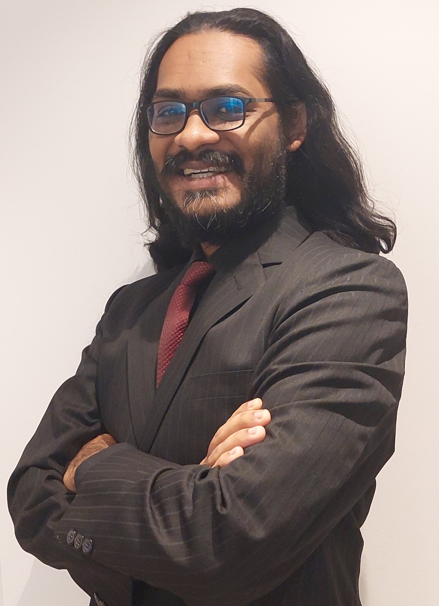
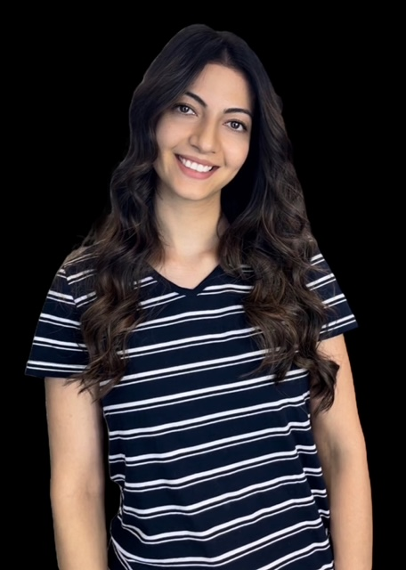
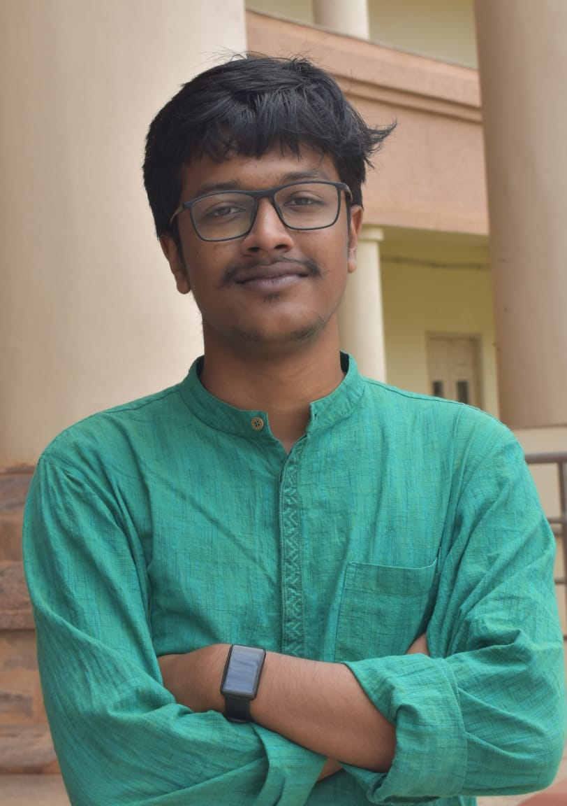
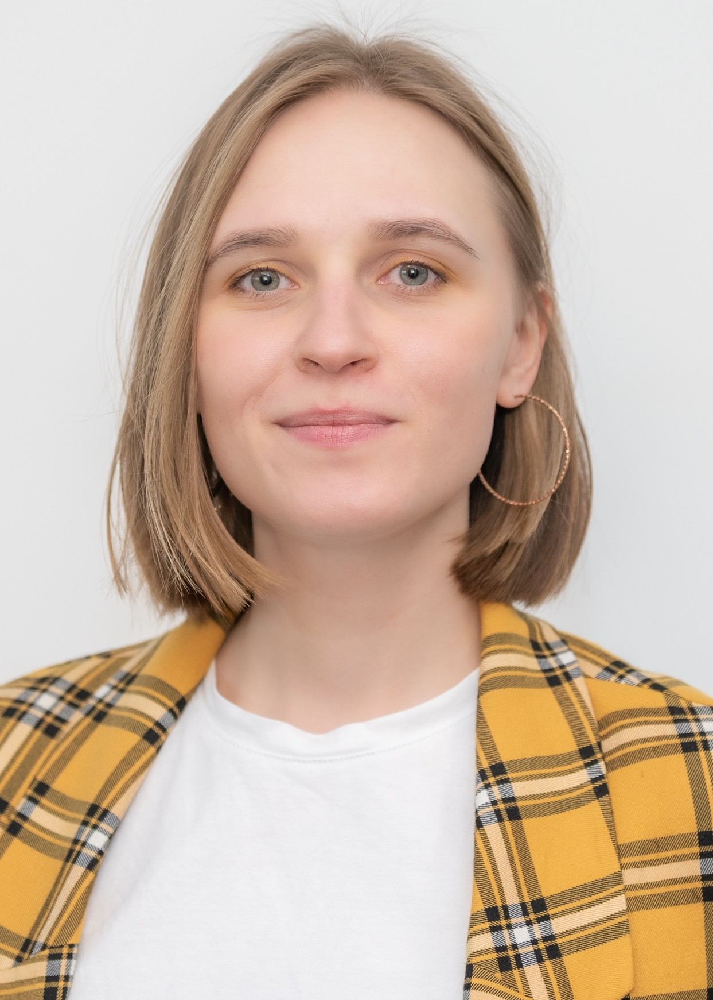
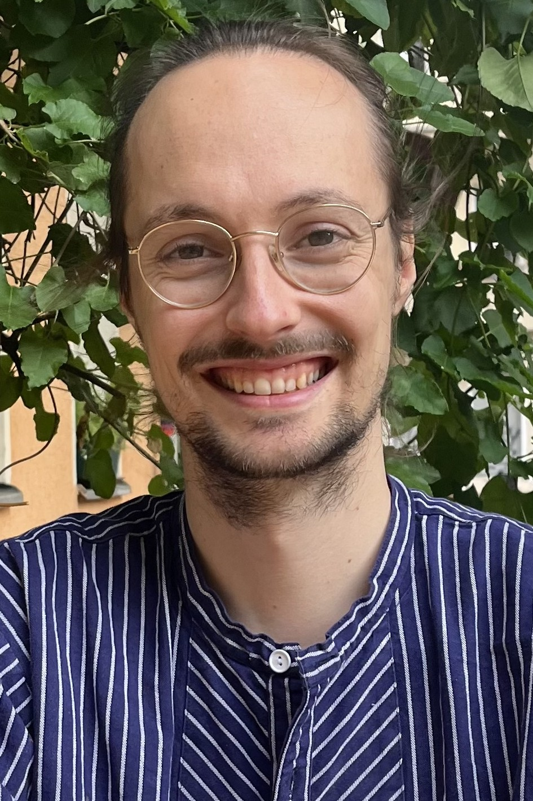
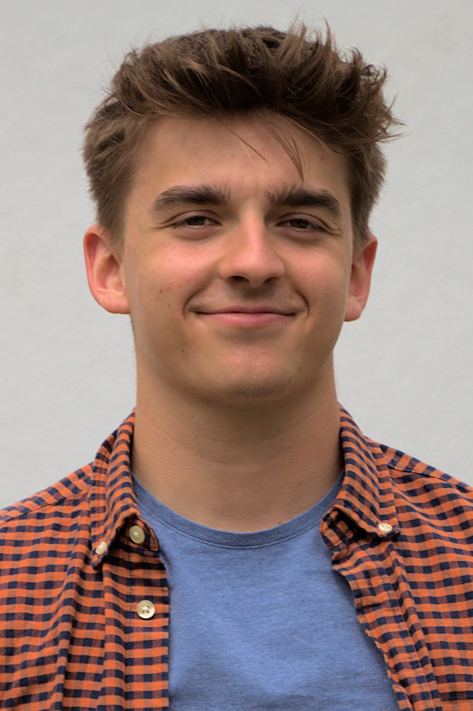
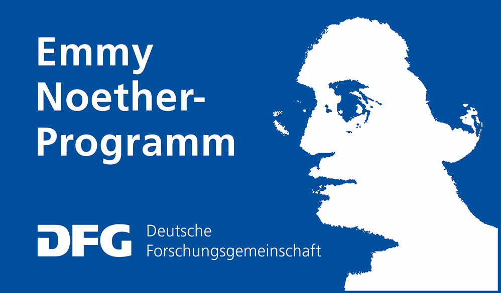

#+AUTHOR: Nakib Haider Protik
#+EMAIL: nakib.haider.protik@gmail.com
#+HTML_HEAD: <link rel="stylesheet" type="text/css" href="thirdparty/worg.css"/>
#+HTML_HEAD: <link rel="icon" type="image/ico" href="logo/group-logo_simplest.svg"/>
#+OPTIONS: H:3 num:nil toc:nil \n:nil ::t |:t ^:t -:t f:t *:t tex:t d:(HIDE) tags:not-in-toc html-postamble:nil

#+ATTR_HTML: :style float:none;

* About us
We are an Emmy Noether research group based in the [[https://www.physik.hu-berlin.de/en/standardseite][Department of Physics]] of [[https://www.hu-berlin.de/en][Humboldt-Universität zu Berlin]]. We carry out theoretical+computational research to understand the thermal and charge transport properties of materials. Our primary focus is on the self-consistent transport of phonons and electrons -- the so-called drag phenomenon.

* People
** Principal Investigator

*** Dr. Nakib H. Protik
#+ATTR_HTML: :style :width 200px;

Nakib obtained his PhD in Physics from Boston College (USA) in 2019. Since then he has been a Postdoctoral Fellow at Harvard University (USA), Postdoctoral Researcher at ICN2 (Spain), and an Alexander von Humboldt Postdoctoral Research Fellow at Humboldt-Universität (Germany) before establishing this group in 2024. His primary focus is on the physics of the interactions and transport phenomena in condensed matter, which he studies using /ab initio/ methods. [[file:./docs/nprotik-cv.pdf][CV]].

** Postdoctoral Researcher
*** Dr. Sally Issa
#+ATTR_HTML: :style :width 200px;

Sally obtained her Master's in Material Science and Nano-Object (SMNO) from Sorbonne University, France. She then completed a PhD in Condensed Matter and Nanoscience from Aix-Marseille University, France, focusing on point defects in high entropy alloys using /ab initio/ atomistic simulations. She then pursued a Postdoctoral position at Freie Universität Berlin. Her research expertise spans material science and computational physics.

** PhD
*** Dwaipayan Paul
#+ATTR_HTML: :style :width 200px;

Dwaipayan completed his Integrated Master's in Physics from the National Institute of Science Education and Research (NISER), India. His research interests include development and application of molecular modeling techniques, with a goal of designing sustainable next-generation devices. In the past, he carried out transport physics research in carbon nanotube heterojunction systems. At present, his work is focused on methods development related to the coupled electron-phonon Boltzmann transport equations. Outside of academia, he enjoys singing and jamming during his free time.

*** Elena Trukhan
#+ATTR_HTML: :style :width 200px;

Elena earned her bachelor’s degree from the Physical Faculty of Moscow State University, where her research work was focused on deriving a formula for measuring the temperature of a magneto-optical trap. Her bachelor’s thesis investigated the amplification of electromagnetic fields scattered by homogeneous spherical nanoparticles, analyzing metallic and dielectric substances separately. She later obtained her master’s degree from the Materials Science Department at the Skolkovo Institute of Science and Technology (Skoltech). Her thesis research, conducted in the Materials Discovery Laboratory, focused on applying reinforcement learning with graph convolutional neural networks to accelerate structural relaxation in computational materials science. Currently, she is working on theory and methods development related to the coupled electron-phonon transport. Beyond research, she enjoys literature and theater.

** Master's thesis student
*** Willy Oesterheld
#+ATTR_HTML: :style :width 200px;

Willy studied the lightcone quantization of the bosonic string for his Bachelor thesis at Humboldt-Universität zu Berlin, where he now is a Master student. During his studies he developed machine learning and image analysis applications for the Biotoxicological group at the Helmholtz Centre for Environmental Research. In cooperation with the Bundesanstalt für Materialforschung und -prüfung (BAM) he is working on his thesis using physics-informed neural networks to predict the temperature field during laser-welding processes. In his free time he likes photography, hockey, and gaming.

** Bachelor's thesis student

*** William Wenig
#+ATTR_HTML: :style :width 200px;

William is working on efficient computation of phonon properties using the Julia language.

** Opening
We do not currently have any opening through the ongoing Emmy Noether funding scheme. However, we are looking to host qualified people through the Alexander von Humboldt, Marie Skłodowska-Curie, Max Planck programs, etc. Interested people are encouraged to get in touch with a CV and statement of research purpose at nakib [dot] protik [at] physik.hu-berlin.de. Please note that our focus is theory and methods development.

* Research Software
** ~elphbolt~
This is a transport physics software suite for the /ab initio/ computation of both the dragful and dragless electron and phonon Boltzmann transport equations. To get started with the code, check out its [[https://github.com/nakib/elphbolt][github repository]] and read about the theory behind it in the accompanying technical paper in [[https://www.nature.com/articles/s41524-022-00710-0.pdf][npj Computational Materials]].

* Colloquium@T2P

** About
This is a series of invited talks given by experts in transport physics and other closely related fields.

** Past speakers

*** February 2, 2026. Vasilii Vasilchenko, Universite catholique de Louvain, Belgium.
[[https://csmb.hu-berlin.de/events/vasilchenko/][Variational approach to self-trapped polarons and hopping transport]]

*** October 9, 2025. Thomas P. van Waas, Universite catholique de Louvain, Belgium.
[[https://csmb.hu-berlin.de/events/van-waas/][Extraction of the self-energy and Eliashberg spectral function from angle-resolved photoemission spectroscopy.]]

*** October 8, 2025. Prof. Dr. Sean Hartnoll, University of Cambridge, UK.
[[https://csmb.hu-berlin.de/events/planckian-bounds/][Planckian bounds on dissipation.]]

*** September 4, 2025. Prof. Dr. Gordon Callsen, University of Bremen, Germany.
[[https://csmb.hu-berlin.de/events/thermal-imaging/][Thermal imaging and phonon mean-free-path spectroscopy by one- and two-laser Raman thermometry.]]

*** October 11, 2024. Dr. Yu Xie, Microsoft AI4Science, Germany.
[[https://csmb.hu-berlin.de/events/uncertainty-aware-molecular-dynamics/][Uncertainty-aware molecular dynamics from Bayesian active learning for phase transformations and thermal transport in SiC.]]

*** August 16, 2024. Prof. Krzystof Kempa, Boston College, USA.
[[https://csmb.hu-berlin.de/events/toward-room-temperature-superconductivity/][Toward room temperature superconductivity via engineered dielectric response of the environment.]]

* Teaching
** Introduction to Many-body Physics
*** Summer 2026
Course info [[https://vlvz2.physik.hu-berlin.de/ss2026/physik/kvlinfo/en/?lvnummer=4020260126][here]].
** Introduction to Transport Physics
*** Summer 2025
Course info [[https://vlvz2.physik.hu-berlin.de/ss2025/physik/kvlinfo/en/?lvnummer=4020250048][here]].
* Funding
#+ATTR_HTML: :style :width 300px;

This group is funded by the [[https://www.dfg.de/en/research-funding/funding-opportunities/programmes/individual/emmy-noether][Emmy Noether Program]] of the German Research Foundation ([[https://www.dfg.de/en][DFG)]].

* Acknowledgment
We thank the fine people at [[https://zulip.com/][Zulip]] for supporting our team communications needs.
